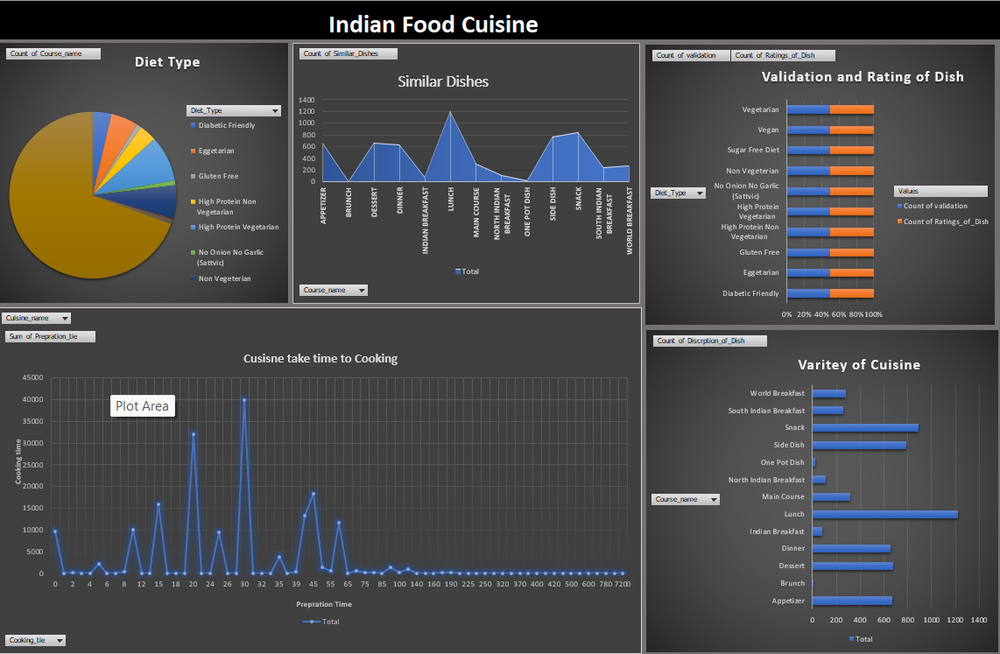

# 🧹 Indian Food Cuisine Data Cleaning with Excel

This project demonstrates effective **data cleaning techniques using Microsoft Excel**. It is designed for anyone looking to understand and apply data preprocessing steps manually through Excel's built-in features and tools.

---

## 📌 Project Overview

Data cleaning is an essential step in the data analysis process. In this project, we focus on identifying and resolving data quality issues such as:

- Missing values
- Duplicate entries
- Inconsistent formatting
- Outliers
- Irrelevant or noisy data

All cleaning tasks are completed **entirely within Excel**, showcasing how powerful spreadsheet tools can be for handling raw datasets.

---

## 🛠 Techniques Used

Here are some of the key Excel features and techniques applied in this project:

- **Remove Duplicates**
- **Find and Replace**
- **Conditional Formatting** (to detect anomalies)
- **Data Validation**
- **Text Functions** (`TRIM`, `UPPER`, `LOWER`, `PROPER`)
- **Date Formatting**
- **Sort and Filter**
- **IF Statements and Logical Functions**
- **Pivot Tables** for data summarization

---

## 📁 Project Structure

